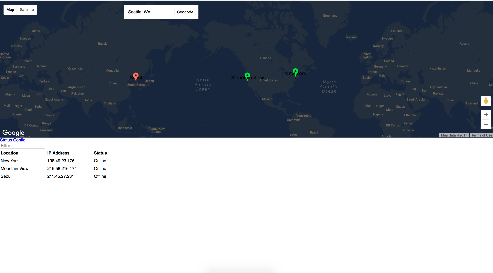
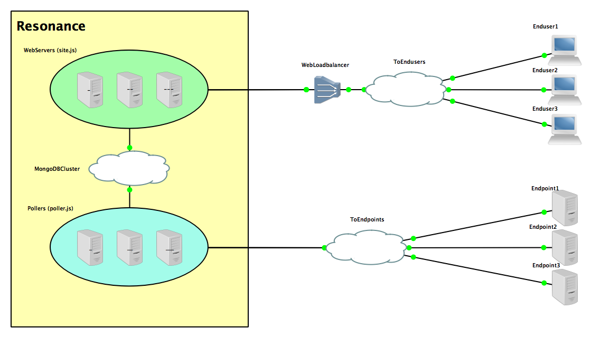

# Resonance - Multisite health check dashboard

Multisite health check dashboard written using the MEAN (Mongo, Express, Angular, Node) stack.  Pollers will check endpoints via ICMP requests to determine if a host is reachable or not.  Data is then visualized via Google Maps API on the front end dashboard.

## Design

Resonance is designed to be distributed to support high availability and scalability.  Web server and poller processes are independent of one another and can be run on multiple nodes.  Web servers can be placed behind load balancers to support additional end user connections to the front end.  Multiple pollers can be started to digest increasing amounts of end points.

## Requirements
- Linux/UNIX system for poller logic
- [node.js](https://nodejs.org/en/)
- [npm](https://www.npmjs.com) (included in NodeJS install)
- [MongoDB Server](https://www.mongodb.com)
- [Google API key](https://console.developers.google.com/flows/enableapi?apiid=picker&credential=client_key&pli=1)

## Installation
### Web Server(s)
1. Copy contents of 'hub' directory
2. Install node.js and npm
3. Change to directory housing 'package.json'
4. Install dependencies
```
npm install
```

### Poller(s)
1. Copy contents of 'spoke' directory
2. Install node.js and npm
3. Change to directory housing 'package.json'
4. Install dependencies
```
npm install
```

### MongoDB
Please follow instructions listed in [MongoDB's documentation](https://www.mongodb.com/download-center?jmp=nav).

## Setup
Start up service in the following order:
1. GoogleAPI key
    1. Obtain Google API key
    ```
    https://console.developers.google.com/flows/enableapi?apiid=picker&credential=client_key&pli=1
    ```
    2. Change to directory housing 'index.html'
    ```
    cd ../resonance/hub/client
    ```
    3. Look for 'https://maps.googleapis.com/maps/api/js?key=GOOGLEAPIKEYHERE'
    4. Change 'GOOGLEAPIKEYHERE' to your API key.
2. MongoDB
3. Web Server(s)
    1. Change to directory housing 'site.js'
    ```
    cd ../resonance/hub
    ```
    2. Grant executable permissions to 'site.js'
    ```
    chmod +x site.js
    ```
    3. Open './server/config/mongoose.js'
    4. Change 'mongodb://localhost:27017/uptime' to match correspond to {mongodb ip}:{mongodb port}/{database name}
    5. Start the web server process
    ```
    ./site.js
    ```
4. Pollers(s)
    1. Change to directory housing 'poller.js'
    ```
    cd ../resonance/poller/
    ```
    2. Grant executable permissions to 'poller.js'
    ```
    chmod +x poller.js
    ```
    3. Open './config/mongoose.js'
    4. Change 'mongodb://localhost:27017/uptime' to match correspond to {mongodb ip}:{mongodb port}/{database name}
    5. Start the poller process
    ```
    ./poller.js
    ```
